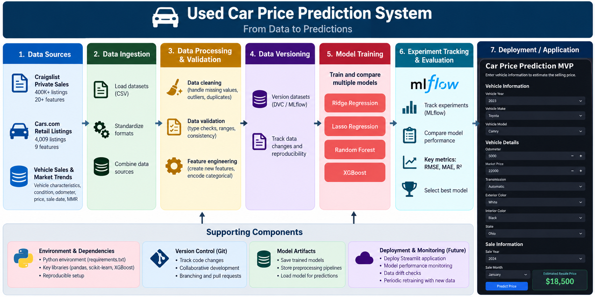

# Used Car Resale Price Prediction

<p align="center">
  
</p>

<p align="center">
  <strong>A machine learning system for estimating used vehicle resale prices using vehicle characteristics and historical market data.</strong>
</p>

<p align="center">
  BANA 7075 — Machine Learning Systems Design
</p>

**Team:** Derek Weaver, Jake Bayman, Adam Ouahidy, Richie James, Bryn Biemiller

## Project Overview

This project develops a machine learning system to predict the resale price of used vehicles based on factors such as mileage, age, make, model, fuel type, transmission, condition, and other vehicle characteristics.

The goal is to provide a consistent, data-driven approach to used vehicle pricing that can support dealerships, private sellers, online marketplaces, and buyers.

## Machine Learning Approach

The project is structured as a supervised regression problem.

We will begin with regularized regression models as baseline models and then evaluate tree-based ensemble models to capture more complex relationships within the data.

Models under consideration include:

- Ridge Regression
- Lasso Regression
- Random Forest
- XGBoost

Experiments and model performance will be tracked using MLflow.

## Data

Three datasets were considered:

1. **Craigslist Private Sales** — A large dataset containing 400K+ vehicle listings and more than 20 features.
2. **Cars.com Retail Listings** — A smaller dataset containing 4,009 retail vehicle listings and 9 features.
3. **Vehicle Sales & Market Trends** — A structured dataset containing vehicle characteristics, condition, odometer readings, selling price, sale date, and Manheim Market Report (MMR) values.

The Vehicle Sales & Market Trends dataset is currently the primary dataset under consideration due to its size, structure, and availability of an industry benchmark.

## Data Pipeline

The project follows a batch-based DataOps pipeline.

## System Architecture

The project follows an end-to-end machine learning pipeline that connects data ingestion, processing, model development, experiment tracking, and deployment.

<p align="center">
  
</p>

```text
Raw Data
    ↓
Ingestion
    ↓
Cleaning & Processing
    ↓
Validation
    ↓
Data Versioning
    ↓
Model Training
    ↓
Evaluation


